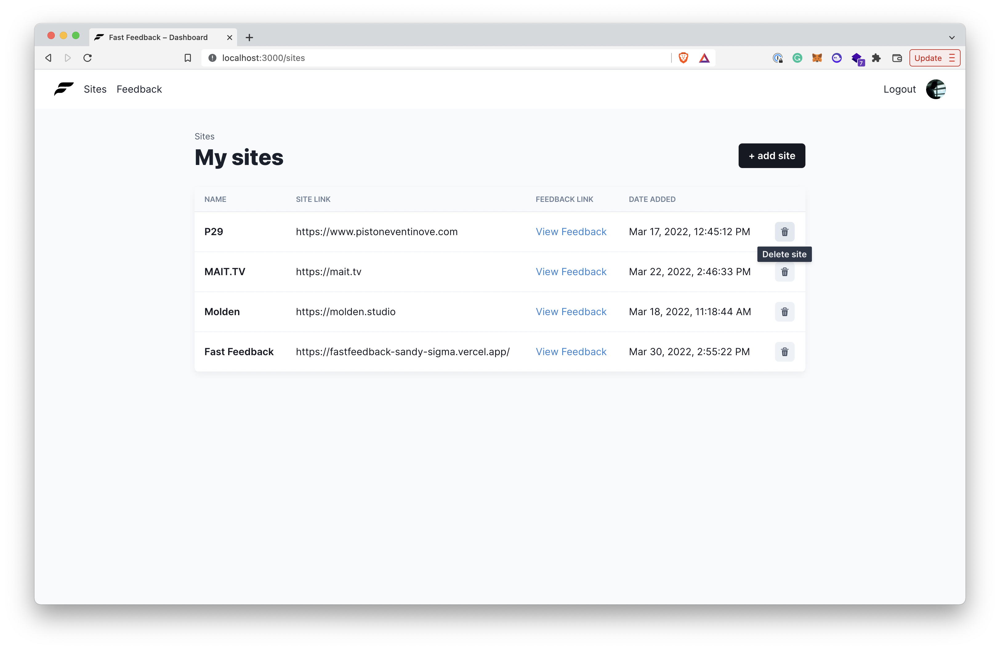

<div id="top"></div>

<!-- PROJECT LOGO -->
<br />
<div align="center">
  

  <h3 align="center">Fast Feedback 2022</h3>

  <p align="center">
   An easy solution for adding comments or reviews to a static site.
    <br />
    <a href="https://fastfeedback-sandy-sigma.vercel.app/"><strong>View demo »</strong></a>
    <br />
  </p>
</div>

<!-- TABLE OF CONTENTS
<details>
  <summary>Table of Contents</summary>
  <ol>
    <li>
      <a href="#about-the-project">About The Project</a>
      <ul>
        <li><a href="#built-with">Built With</a></li>
      </ul>
    </li>
    <li>
      <a href="#getting-started">Getting Started</a>
      <ul>
        <li><a href="#prerequisites">Prerequisites</a></li>
        <li><a href="#installation">Installation</a></li>
      </ul>
    </li>
    <li><a href="#usage">Usage</a></li>
    <li><a href="#roadmap">Roadmap</a></li>
    <li><a href="#contributing">Contributing</a></li>
    <li><a href="#license">License</a></li>
    <li><a href="#contact">Contact</a></li>
    <li><a href="#acknowledgments">Acknowledgments</a></li>
  </ol>
</details> -->

<!-- ABOUT THE PROJECT -->

## About The Project



This version of <strong>Fast Feedback</strong> was built by <u>Leandro Argentiero</u> as part of React 2025 and completely adapted to Firebase's v9 modular SDK. Fast Feedback is an easy SaaS solution for adding comments or reviews to a static site. It's still a work in progress, but you can try it out by leaving a comment below or logging and start adding your own sites.

### Built With

- [Next.js](https://nextjs.org/)
- [React.js](https://reactjs.org/)
- [Chakra UI](https://chakra-ui.com/)
- [Firebase](https://firebase.google.com/)
- [Firebase Admin](https://firebase.google.com/docs/database/web/read-and-write)
- [SWR](https://swr.vercel.app/)
- [React Hook Form](https://react-hook-form.com/)
- [Checkly](https://www.checklyhq.com/)
- [Vercel](https://vercel.com)

<!-- GETTING STARTED -->

## Getting Started

## Prerequisites

Please consult <code>.env.example</code> for adding necessary env variables in <code>.env.example</code>.

## Installing project

```
clone project
cd fastfeedback
```

Install the dependencies

```
yarn
```

Start development server

```
yarn dev
Visit http://localhost:3000
```

## Building for production

To create an optimised version of the app

```
yarn build

```

<p align="right">(<a href="#top">back to top</a>)</p>
